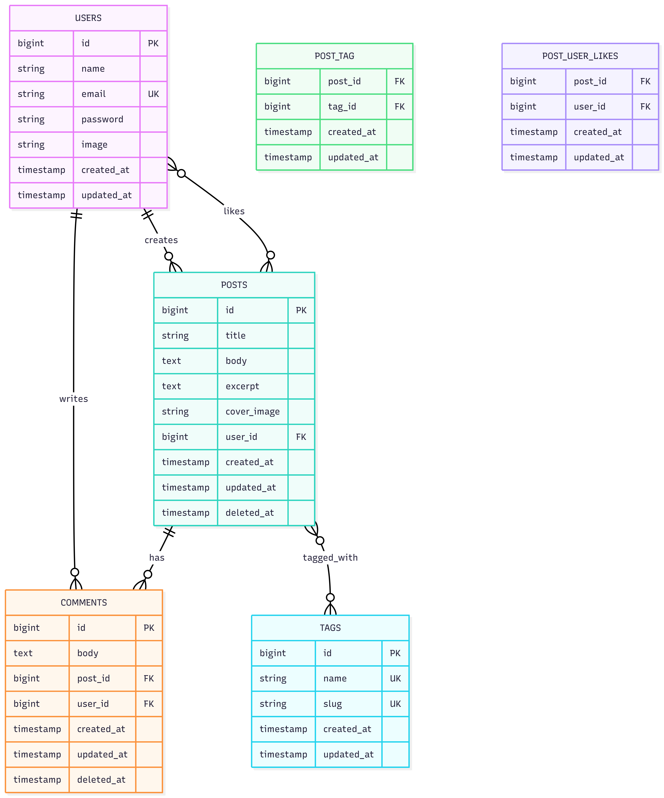

# 🐝 BuzzByte

> A modern full-stack blog with ephemeral posts that auto-delete after 24 hours

[](https://react.dev/)
[](https://laravel.com/)
[](https://www.typescriptlang.org/)
[](https://docs.docker.com/compose/)

## 🚀 Quick Start

### Prerequisites

Make sure you have installed:
- **Docker Desktop** - [Download here](https://www.docker.com/products/docker-desktop/)
- **Git** - [Download here](https://git-scm.com/downloads)

### Installation

```bash
# 1. Clone the repository
git clone https://github.com/IntMain1/buzzbyte-blog.git

# 2. Navigate to project folder
cd buzzbyte-blog

# 3. Start all containers (this may take a few minutes on first run)
docker-compose up --build -d

# 4. Run database migrations and seed demo data
docker-compose exec backend php artisan migrate:fresh --seed

# 5. Create storage link for image uploads
docker-compose exec backend php artisan storage:link
```

### Verify Installation

Check all containers are running:
```bash
docker-compose ps
```

You should see 6 containers running:
- `buzzbyte_frontend` (React app)
- `buzzbyte_backend` (Laravel API)
- `buzzbyte_mysql` (Database)
- `buzzbyte_redis` (Cache/Queue)
- `buzzbyte_worker` (Background jobs)
- `buzzbyte_scheduler` (Scheduled tasks)

**Access:**

- 🌐 **Frontend**: http://localhost:3000
- 🔌 **Backend API**: http://localhost:8000/api
- 📚 **Swagger API Docs**: http://localhost:8000/api/documentation

**Demo Login:**
| Email | Password |
|-------|----------|
| `demo@buzzbyte.com` | `demo1234` |
| `john@example.com` | `password` |

## ✨ Features

- **JWT Authentication** – Secure login/signup with profile image upload
- **Ephemeral Posts** – Posts auto-delete after 24 hours with countdown timer
- **Markdown Editor** – Write in Markdown with live preview
- **Dark Mode** – Toggle dark/light theme with persistence
- **Post Likes** – Like posts with optimistic UI updates
- **Comments** – Add, edit, delete comments on any post
- **Tags** – Organize posts with tags (minimum 1 required)
- **Toast Notifications** – User feedback for all actions
- **Error Boundary** – Graceful error handling with recovery UI
- **Mobile-First** – Responsive design for all devices

## 🏗️ Tech Stack

| Layer       | Technology                                  |
| ----------- | ------------------------------------------- |
| Frontend    | React 19, TypeScript, Vite, Tailwind CSS v4 |
| Backend     | Laravel 12, PHP 8.4, Sanctum Auth           |
| Database    | MySQL 8                                     |
| Cache/Queue | Redis 7                                     |
| Containers  | Docker Compose                              |

## 📦 Docker Services

| Container            | Port | Description       |
| -------------------- | ---- | ----------------- |
| `buzzbyte_frontend`  | 3000 | React app (Nginx) |
| `buzzbyte_backend`   | 8000 | Laravel API       |
| `buzzbyte_mysql`     | 3306 | MySQL database    |
| `buzzbyte_redis`     | 6379 | Redis queue       |
| `buzzbyte_worker`    | -    | Queue worker      |
| `buzzbyte_scheduler` | -    | Cron scheduler    |

## 🧪 Testing

The project includes comprehensive feature tests covering happy and unhappy paths.

```bash
# Run all tests
docker-compose exec backend php artisan test

# Run with detailed output
docker-compose exec backend php artisan test --testdox
```

### Test Coverage

| Test Suite | Tests | Description |
|------------|-------|-------------|
| AuthTest | 8 | Registration, login, logout, protected routes |
| PostTest | 7 | CRUD operations, authorization |
| CommentTest | 5 | Add/edit/delete comments, ownership |
| LikeTest | 6 | Like/unlike, counts, edge cases |
| TagTest | 7 | Tag management, validation |
| ExpiredPostsTest | 5 | Auto-deletion after 24h |

**Total: 40 tests, 121 assertions** ✅

### Test Scenarios Covered

✅ **Happy Paths:**
- Successful user registration and login
- Creating, updating, deleting posts
- Adding comments to any post
- Liking/unliking posts

❌ **Unhappy Paths:**
- Invalid credentials rejected
- Duplicate email registration blocked
- Unauthorized access to protected routes (401)
- Cannot edit/delete others' posts (403)
- Cannot edit/delete others' comments (403)
- Post requires at least one tag (422)

## 🔧 Development

```bash
# Start all services
docker-compose up --build -d

# Run migrations and seed
docker-compose exec backend php artisan migrate:fresh --seed

# View logs
docker logs buzzbyte_backend -f

# Run tests
docker-compose exec backend php artisan test

# Stop all
docker-compose down
```

## 📝 API Endpoints

| Method | Endpoint                   | Description      | Auth |
| ------ | -------------------------- | ---------------- | ---- |
| POST   | `/api/register`            | Create account   | ❌ |
| POST   | `/api/login`               | Get auth token   | ❌ |
| POST   | `/api/logout`              | Revoke token     | ✅ |
| GET    | `/api/me`                  | Get current user | ✅ |
| PUT    | `/api/profile`             | Update profile   | ✅ |
| GET    | `/api/posts`               | List posts       | ✅ |
| POST   | `/api/posts`               | Create post      | ✅ |
| GET    | `/api/posts/{id}`          | View post        | ✅ |
| PUT    | `/api/posts/{id}`          | Update post      | ✅ (owner) |
| DELETE | `/api/posts/{id}`          | Delete post      | ✅ (owner) |
| POST   | `/api/posts/{id}/like`     | Toggle like      | ✅ |
| GET    | `/api/posts/{id}/comments` | List comments    | ✅ |
| POST   | `/api/posts/{id}/comments` | Add comment      | ✅ |
| PUT    | `/api/comments/{id}`       | Update comment   | ✅ (owner) |
| DELETE | `/api/comments/{id}`       | Delete comment   | ✅ (owner) |
| GET    | `/api/tags`                | List tags        | ✅ |
| POST   | `/api/tags`                | Create tag       | ✅ |
| DELETE | `/api/tags/{id}`           | Delete tag       | ✅ |

## 📁 Project Structure

```
buzzbyte-blog/
├── docker-compose.yml
├── README.md
├── backend/                  # Laravel API
│   ├── app/
│   │   ├── Http/
│   │   │   ├── Controllers/Api/
│   │   │   └── Requests/     # Form Requests (validation)
│   │   ├── Models/
│   │   ├── Services/         # Business Logic
│   │   └── Jobs/             # Scheduled jobs
│   ├── database/
│   │   ├── migrations/       # Database schema
│   │   └── seeders/          # Demo data
│   └── tests/
│       └── Feature/          # API tests
└── frontend/                 # React App
    └── src/
        ├── components/
        │   ├── ui/           # Shared UI components
        │   ├── Header.tsx
        │   ├── PostCard.tsx
        │   └── ErrorBoundary.tsx
        ├── contexts/         # Auth & Toast
        ├── hooks/            # Custom hooks
        ├── lib/              # API client
        ├── pages/            # Route pages
        └── types/            # TypeScript types
```

## 🔐 Security Features

- **JWT Authentication** via Laravel Sanctum
- **Rate Limiting** on auth endpoints (5 req/min login, 3 req/min register)
- **Password Hashing** with bcrypt
- **Input Validation** on all endpoints via Form Requests
- **Authorization Policies** for resource ownership
- **CORS Configuration** for API access

## ⏰ Post Expiration System

Posts automatically expire after 24 hours using:

1. **Laravel Scheduler** - Runs `posts:delete-expired` every hour
2. **Redis Queue** - Async job processing for deletion
3. **Queue Worker** - Dedicated container for job execution
4. **Soft Deletes** - Posts are soft-deleted for recovery if needed

## 🔐 Environment Variables

Copy `.env.example` to `.env` in the backend folder. Key variables:

| Variable      | Default  | Description       |
| ------------- | -------- | ----------------- |
| `APP_KEY`     | (auto)   | Laravel app key   |
| `DB_DATABASE` | buzzbyte | Database name     |
| `DB_PASSWORD` | secret   | Database password |

## �‍💻 Author

**Omar Tarek** - Sole Developer

## �📄 License
MIT

## 📐 System Architecture

### System Overview


### Request Flow


### Authentication Flow


### Database Schema (ERD)



